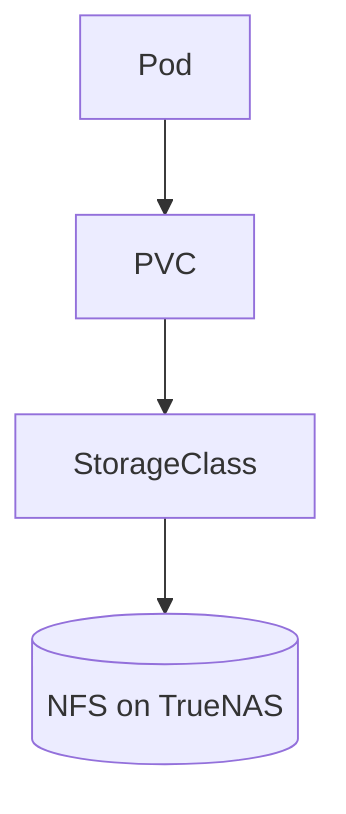

## Overview

```mermaid
graph TD
  A[Pod] --> B[PVC]
  B --> C[StorageClass]
  C --> D[(NFS on TrueNAS)]
```

Persistent volumes are backed by an NFS export from TrueNAS, provisioned
dynamically via a `StorageClass`.
