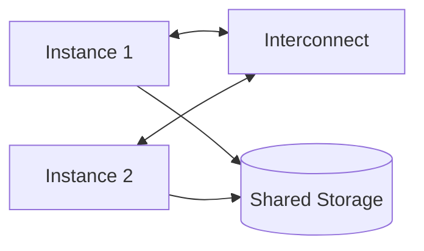

## Overview

```mermaid
graph LR
  A[Instance 1] <--> C[Interconnect]
  B[Instance 2] <--> C
  A --> D[(Shared Storage)]
  B --> D
```

A two-node RAC deployment with a dedicated private interconnect for Cache
Fusion traffic and shared storage visible to both instances.
