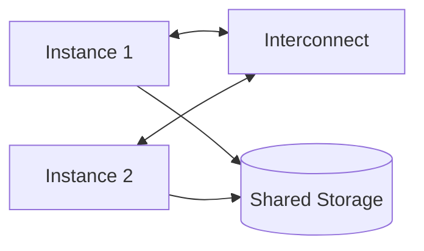

Cache Fusion is the mechanism Oracle RAC uses to keep each instance's buffer
cache consistent without constantly writing blocks back to disk.

## How it works

When one instance needs a block held in another instance's cache, the block
is shipped directly over the interconnect rather than being read from disk.

<Callout type="note">
  This is why a fast, low-latency interconnect matters more for RAC performance than
  storage throughput in many workloads.
</Callout>

### Global Cache Service

The GCS tracks which instance owns the current version of each block.

```sql showLineNumbers title="check-gcs.sql"
SELECT inst_id, class, count(*)
FROM gv$bh
GROUP BY inst_id, class
ORDER BY inst_id;
```

<Callout type="warning">
  Excessive cross-instance block transfers ("cluster wait" events) usually indicate a
  partitioning problem in the application, not a RAC misconfiguration.
</Callout>

## Installing the interconnect test tool

<CodeGroup>
  ```bash title="npm" npm install -g oratop ``` ```bash title="yarn" yarn global add
  oratop ```
</CodeGroup>

## Two-node cluster topology



## Wait event thresholds

| Wait Event       | Warning | Critical |
| ---------------- | ------- | -------- |
| gc cr block busy | > 5ms   | > 20ms   |
| gc buffer busy   | > 5ms   | > 20ms   |

The average block transfer latency is roughly $L = \frac{N}{B}$, where $N$ is
network round-trip time and $B$ is interconnect bandwidth.

Placeholder KB article — full editorial pass lands in Step 7 (Knowledge Base).
